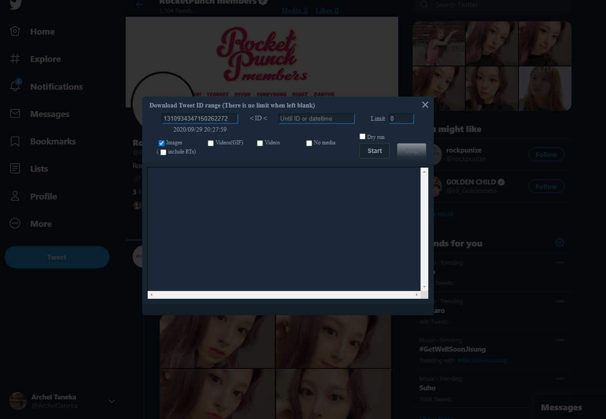

# Video Face Recognition
This project will detect faces in a video file. Through the ability of deep learning, you can train the model with your own custom dataset to detect and recognize faces.

## 1. Prerequisites
<ul>
    <li> Numpy v.1.19
    <li> PyTorch v.1.6.0
    <li> CUDA 10.2 (optional for GPU training)
    <li> ffpyplayer (optional for audio playback)
    <li> Dataset (Twitter Media Downloader)
</ul>

## 2. Usage
<ol>
    <li> Run Twitter Media Downloader or obtain your own dataset
    <li> Open playground.ipynb
    <li> Change the hyperparameters if necessary, run
    <li> Repeat until you get the best result
</ol>

### (Optional) Twitter Media Downloader
I used Twitter Media Downloader to download a large number of images. It's great if you use Chrome for your daily browser, because there is an extension that you can install. You can follow this [link](https://chrome.google.com/webstore/detail/twitter-media-downloader/cblpjenafgeohmnjknfhpdbdljfkndig?hl=en) to download and install it in your Chrome browser

<container>
    
</container>

Open [Twitter](twitter.com) then create an account or sign in if you have one. Find your favorite actors/actresses or singers to download their images. On the very top beside the username account, you will see something like this

<container>
    
</container>

Click 'Media', and you will be shown a prompt to download the images. You can filter the start date, include gifs or videos, retweets, etc.

<container>
    
</container>

If you are done, click 'Start' to start downloading the images.

## 3. Example
At the end of the project, you will be able to see the final results similar to something like this
<container>
    
</container>
